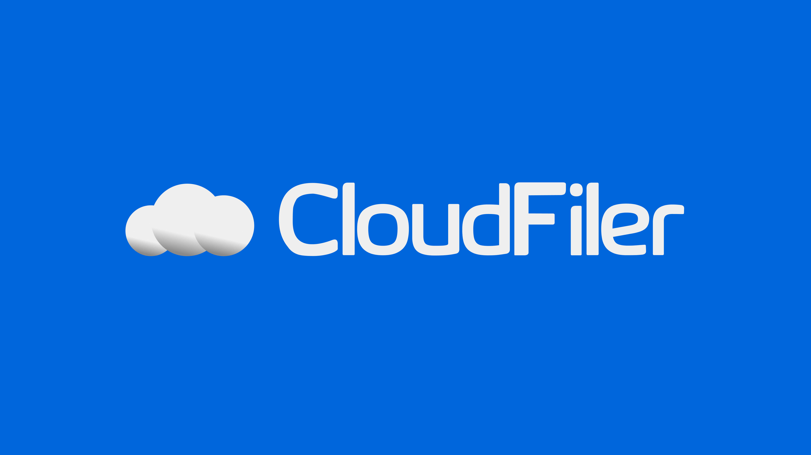

### CloudFiler - Облачный сервис для хранения файлов

**CloudFiler** — это облачный сервис для хранения файлов с возможностью их шейринга между пользователями. Проект написан на ванильном PHP и использует JSON Web Token (JWT) для авторизации и работы с сессиями через access и refresh токены.

#### Возможности CloudFiler:
- Хранение файлов в облаке
- Совместное использование файлов с другими пользователями
- Авторизация с использованием JWT (access и refresh токены)
- Безопасность данных благодаря использованию современных методов авторизации

---

### Запуск локально

Для запуска CloudFiler локально необходимо следовать следующим шагам:

#### Требования:
- PHP >= 7.4
- Composer
- Сервер XAMPP или другой локальный сервер с поддержкой PHP

#### Шаги установки:

1. **Склонировать репозиторий:**

    ```bash
    git clone https://github.com/your-repository/cloud-filer.git
    ```

2. **Для XAMPP (Windows/MacOS/Linux)**:
   - Переместите репозиторий в папку `htdocs` XAMPP. Обычно расположение папки:
     - Windows: `C:/xampp/htdocs/`
     - MacOS: `/Applications/XAMPP/htdocs/`
     - Linux: `/opt/lampp/htdocs/`
   
   **Для других систем (например, LAMP/WAMP):**
   - Поместите проект в корневую папку веб-сервера. Для LAMP это `/var/www/html/`, для WAMP это `C:/wamp/www/`.

3. **Установка зависимостей через Composer:**

    Перейдите в директорию с проектом и выполните команду:
    
    ```bash
    composer install
    ```

4. **Настройка окружения:**
   - Создайте файл `.env` в корне проекта и укажите необходимые переменные окружения (например, базу данных и секретный ключ для JWT).

5. **Запуск локального сервера:**

   Запустите ваш локальный сервер через XAMPP (или другой установленный сервер) и откройте браузер.

6. **Откройте CloudFiler в браузере:**

    Перейдите по адресу:

    ```bash
    http://localhost/cloud-filer/
    ```

---

### Стек технологий

- **Backend**: PHP (vanilla)
- **Authorization**: JWT (JSON Web Token)
- **Database**: MySQL (или другая поддерживаемая база данных)
- **Package Manager**: Composer

---

### Важные моменты:

1. **JWT Авторизация**:
   - Для доступа к ресурсам используется `access token` с ограниченным сроком действия.
   - После истечения срока действия `access token` автоматически обновляется с использованием `refresh token`.

2. **Безопасность**:
   - Все пользовательские данные защищены, а авторизация и аутентификация реализованы через современные методы.

3. **Репозитории**:
    - В проекте **CloudFiler** для работы с базой данных используются **репозитории**, которые представляют собой объекты для управления данными в конкретных таблицах. 
    - Каждый репозиторий олицетворяет собой соответствующую таблицу базы данных и может переопределять методы родительского класса `DB`, обеспечивая гибкость и кастомизацию под бизнес-логику приложения. 

--- 

Спасибо за использование **CloudFiler**! 😄